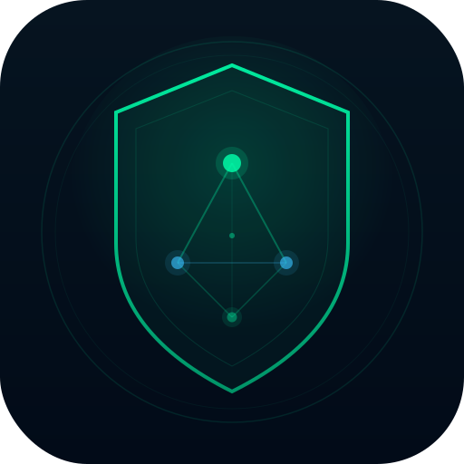

<div align="center">



# AegisMap

**Local-first network reconnaissance & authorised pentesting workstation**

Tauri 2 · Rust · React 19 · Three.js · SQLite

[](LICENSE)
[](https://github.com/danielchani/AegisMap/releases)

</div>

---

## Live Demo

<div align="center">

[](https://www.youtube.com/watch?v=TGdgScoD9a8)

*Click to watch the full demo on YouTube*

</div>

---

## What is AegisMap?

AegisMap is a desktop application built for security professionals, researchers, and students conducting **authorised** network reconnaissance and penetration testing. It wraps Nmap in a type-safe, audited pipeline, renders your network as an interactive 3D hologram, and gives you a structured workspace to collect findings and evidence — all running locally with no cloud dependency.

> **Authorised use only.** Scanning networks without explicit permission is illegal. AegisMap is designed for ethical security testing, CTF challenges, lab environments, and authorised engagements.

---

## Features

### Scanning Engine
| Feature | Details |
|---|---|
| **8 scan profiles** | Quick (top 100), Standard TCP (all ports), Service Detection (versions), OS Detect, UDP Common, Stealth SYN, ACK Probe, Evasion |
| **Stealth SYN** | `-sS` half-open scan — never completes the TCP handshake, quieter than connect scan |
| **ACK probe** | Maps firewall rulesets: RST = unfiltered, dropped = filtered |
| **Evasion scan** | `-sS -f -D` — packet fragmentation + IP decoys to challenge IDS logging |
| **IP decoys** | Manual or auto-generated (`RND:N`) decoy IPs via `-D`, strictly validated (max 8) |
| **Source-port spoofing** | `--source-port` to cross firewalls that trust DNS/53, HTTP/80, etc. |
| **NSE scripts** | 14 read-only recon scripts allowlisted: `http-title`, `ssl-cert`, `ssh-hostkey`, `smb-security-mode`, `ftp-anon`, `banner`, and more |
| **Scan queue** | Queue multiple targets; they run automatically back-to-back |
| **Streaming output** | Live console feed with progress % and ETA |

### Intelligence Probes (opt-in per host)
| Probe | Details |
|---|---|
| **HTTP/HTTPS surface** | Native probe via `reqwest + rustls` — status code, title, server header, tech fingerprint, 10-header security scorecard (HSTS, CSP, X-Frame, etc.) |
| **TLS certificate chain** | Raw TLS handshake captures full cert chain — CN, SANs, issuer, expiry countdown, self-signed detection, weak cipher flagging |
| **DNS intelligence** | PTR, A/AAAA, CNAME, MX, NS, TXT — forward-verify check flags PTR mismatches |
| **Live CVE lookup** | Per-product NVD API v2 query — CVSS scores, severity badges, references, 24h SQLite cache, optional API key for 10× rate limit |

### 3D Holographic Visualization
- Interactive Three.js scene with risk-colored host nodes, animated port orbs, service arc rings, and subnet zone boundaries
- **Diff mode** — compare two sessions side-by-side; added/removed/changed hosts highlighted
- **Confidence mode** — 7-dimension host fingerprint score visualized per node
- Risk-level filter, label density LOD, connection lines, and camera presets

### Findings & Evidence Workspace
- Structured finding cards: severity, confidence tier, status lifecycle, affected hosts/ports
- Evidence linking: advisory matches, script output, probe results, manual notes
- CVE candidates always start as `candidate` confidence — never auto-confirmed
- One-click `+F` buttons on CVE entries, port advisories, version advisories, DNS anomalies, and NSE script results

### Session Management
- **SQLite** persistence (WAL mode) at the platform app-data directory
- Named sessions, session merge, cross-session diff engine
- SHA-256 chained audit log — every action recorded; clear operations logged before execution
- Export: JSON · CSV · Markdown · PDF

### Strategy & Guidance
- Rule-based **scan strategy suggestions** per host (7 signal types)
- 5 recon **playbooks** with step-by-step guided workflows
- Scope manager with CIDR validation — out-of-scope targets require explicit confirmation

---

## Architecture

```
AegisMap/
├── src/                     # React 19 + TypeScript frontend
│   ├── components/          # UI components (HostInspector, ScanScene, FindingsPanel, …)
│   ├── lib/                 # Pure logic (riskScore, fingerprint, sessionDiff, playbooks, …)
│   ├── data/                # Bundled CVE/advisory/version databases
│   └── types/               # Shared TypeScript types
└── src-tauri/               # Rust backend
    ├── src/
    │   ├── scanner/         # Nmap executor, XML parser, streaming, validation, profiles
    │   ├── intelligence/    # HTTP, TLS, DNS, CVE probes
    │   ├── db*.rs           # SQLite: schema, sessions, findings, audit log, migration
    │   └── commands/        # Tauri IPC commands exposed to frontend
    └── Cargo.toml
```

**Stack:** Tauri 2 · React 19 · TypeScript 5.8 · Vite 7 · Three.js (React Three Fiber) · Rust / Tokio · rusqlite (bundled) · reqwest + rustls · tokio-rustls · hickory-resolver

---

## Security Design

- **No shell execution** — Nmap launched via `std::process::Command` with discrete `.arg()` calls; no shell interpolation possible
- **NSE allowlist** — 14 hardcoded read-only scripts; arbitrary script injection rejected server-side
- **CIDR limits** — /20 for IPv4, /48 for IPv6 enforced in the validation layer
- **CVE product names** validated to `[a-zA-Z0-9 \-._]` before NVD URL construction; HTTPS only; 2 MB response cap; CVE IDs re-validated on receipt
- **NVD API key** stored in SQLite `settings` table; never returned to frontend (only a boolean "key configured" status is exposed)
- **Audit log** is SHA-256 chained — each entry hashes the previous entry's hash, making silent tampering detectable
- **SQL CHECK constraints** enforce valid enum values for severity, confidence, and status in the `findings` table
- **Randomised temp paths** for nmap XML output (Knuth hash) prevent predictable filenames
- TLS intelligence probe intentionally accepts invalid/expired certs — pentest recon mode

---

## Requirements

| Requirement | Notes |
|---|---|
| **Nmap** | Must be installed separately and on `PATH` |
| **WebView2** | Pre-installed on Windows 10/11; bootstrapped automatically by the installer |
| **Admin / root** | Only required for privileged scan profiles (Stealth SYN, ACK Probe, Evasion, OS Detect, UDP) |

---

## Installation

### Windows (recommended)

Download the NSIS installer from [Releases](https://github.com/danielchani/AegisMap/releases):

```
AegisMap_0.1.0_x64-setup.exe
```

- No administrator rights needed to install (installs to `%LOCALAPPDATA%`)
- WebView2 is bootstrapped automatically if missing
- Then install [Nmap](https://nmap.org/download.html) if you haven't already

Alternatively, use the raw portable binary `aegismap.exe` — just run it directly, no installer needed.

### Build from Source

```bash
# Prerequisites: Rust toolchain, Node.js 18+, Nmap
git clone https://github.com/danielchani/AegisMap.git
cd AegisMap
npm install
npm run tauri dev          # development with hot reload
npm run tauri build        # production build → dist + NSIS installer
```

---

## Testing

```bash
npm run test:run           # 121 frontend tests (Vitest + jsdom)
cd src-tauri && cargo test # 153 Rust tests
npx tsc --noEmit           # TypeScript type check (must be zero errors)
```

---

## Screenshots

> See the [Live Demo](#live-demo) video above for a full walkthrough.
d
---

## Roadmap

- [ ] macOS & Linux packaging
- [ ] Plugin / extension API for custom intelligence probes
- [ ] Collaborative session sharing (encrypted, local-network)
- [ ] Report templates (OWASP, PTES)
- [ ] CVSS 4.0 support

---

## License

MIT — see [LICENSE](LICENSE) for details.

AegisMap is provided for **authorised security testing, research, and educational use only**. The authors are not responsible for misuse. Always obtain explicit written permission before scanning any network you do not own.

---

<div align="center">
<sub>Built with Tauri · React · Rust · Three.js</sub>
</div>
